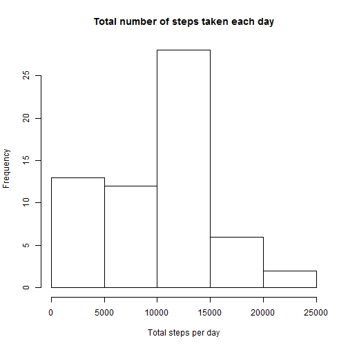

# Reproducible Research: Peer Assessment 1

This is the first peer assessment for Peproducible Research in Data Science Specialization. You could find more information [Here](https://class.coursera.org/repdata-002/human_grading/view/courses/972084/assessments/3/submissions).

## Loading and preprocessing the data

First of all, open the [GitHub repository created for the assessment](https://github.com/rdpeng/RepData_PeerAssessment1), and fork or clone the repo into local folder.  The GitHub repository also contains the dataset for the assignment, so you do not have to download the data separately.

#### 1. Load the data. 

Set the working directory into the github folder using ``setwd()``, and then unzip the data file and read in the data using ``read.csv()``.

    
    ```r
    # set working directory
    setwd("K:\\MOOCs - Data Science Specialization\\5. Reproducible Research\\PeerAssessment1\\Github")
    unzip("activity.zip")  # unzip file
    dir()
    ```
    
    ```
    ## [1] "activity.csv"      "activity.zip"      "doc"              
    ## [4] "figure"            "instructions_fig"  "PA1_template.html"
    ## [7] "PA1_template.md"   "PA1_template.Rmd"  "README.md"
    ```
    
    ```r
    Activity <- read.csv("activity.csv", colClasses = c("numeric", "character", 
        "numeric"))
    dim(Activity)
    ```
    
    ```
    ## [1] 17568     3
    ```


#### 2. Process/transform the data (if necessary) into a format suitable for your analysis. 

Combine the date and interval into a new variable _DateTime_, and then convert date into date format.

    
    ```r
    Activity$Datetime <- strptime(paste(Activity$date, formatC(Activity$interval, 
        width = 4, flag = "0"), sep = " "), "%Y-%m-%d %H%M")
    Activity$date <- as.Date(Activity$date)
    ```


## What is mean total number of steps taken per day?

#### 1. Make a histogram of the total number of steps taken each day.

- Use the ``ddply()`` function in _plyr_ package to generate sums of each day.
    
- Set ``na.rm=TRUE`` to ignore the missing values.
    
- plot a histgraom.

    
    ```r
    require(plyr)
    ```
    
    ```
    ## Loading required package: plyr
    ```
    
    ```r
    SumStep <- ddply(Activity, .(date), summarise, steps = sum(steps, na.rm = TRUE))
    hist(SumStep$steps, xlab = "Total steps per day", main = "Total number of steps taken each day")
    ```
    
     


#### 2. Calculate and report the mean and median total number of steps taken per day

    
    ```r
    # Mean and median total number of steps taken per day
    mean(SumStep$steps)
    ```
    
    ```
    ## [1] 9354
    ```
    
    ```r
    # Median total number of steps taken per day
    median(SumStep$steps)
    ```
    
    ```
    ## [1] 10395
    ```


## What is the average daily activity pattern?


## Imputing missing values


## Are there differences in activity patterns between weekdays and weekends?
