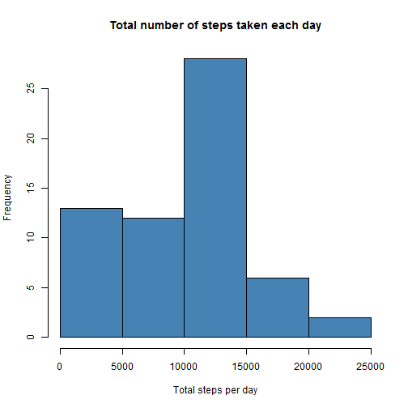
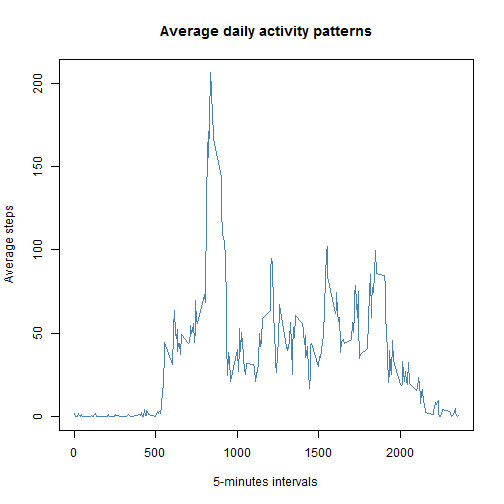
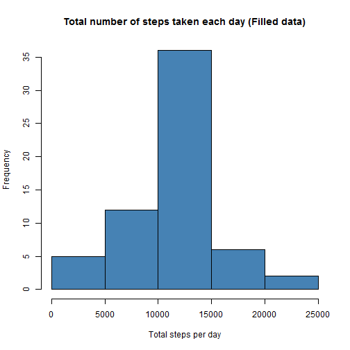
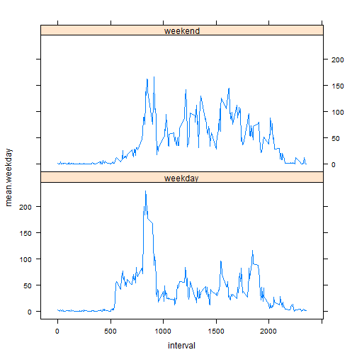

# Reproducible Research: Peer Assessment 1

This is the first peer assessment for Peproducible Research in Data Science Specialization. You could find more information [Here](https://class.coursera.org/repdata-002/human_grading/view/courses/972084/assessments/3/submissions).

## Loading and preprocessing the data

First of all, open the [GitHub repository created for the assessment](https://github.com/rdpeng/RepData_PeerAssessment1), and fork or clone the repo into local folder.  The GitHub repository also contains the dataset for the assignment, so you do not have to download the data separately.

#### 1.Load the data. 

Set the working directory into the github folder using ``setwd()``, and then unzip the data file and read in the data using ``read.csv()``.


```r
# set working directory
setwd("K:\\MOOCs - Data Science Specialization\\5. Reproducible Research\\PeerAssessment1\\Github")
unzip("activity.zip")  # unzip file
dir()  # list files
```

```
##  [1] "activity.csv"      "activity.zip"      "cache"            
##  [4] "doc"               "figure"            "instructions_fig" 
##  [7] "PA1_template.html" "PA1_template.md"   "PA1_template.Rmd" 
## [10] "README.md"
```

```r
# read in data
Activity <- read.csv("activity.csv", colClasses = c("numeric", "character", 
    "numeric"))
dim(Activity)
```

```
## [1] 17568     3
```


#### 2.Process/transform the data (if necessary) into a format suitable for your analysis. 

Combine the date and interval into a new variable _DateTime_, and then convert date into date format.


```r
# Generate a new Datetime variable
Activity$Datetime <- strptime(paste(Activity$date, formatC(Activity$interval, 
    width = 4, flag = "0"), sep = " "), "%Y-%m-%d %H%M")
# convert date into date format
Activity$date <- as.Date(Activity$date)
```


## What is mean total number of steps taken per day?

#### 1.Make a histogram of the total number of steps taken each day.

- Use the ``ddply()`` function in _plyr_ package to generate sums of each day.
    
- Set ``na.rm=TRUE`` to ignore the missing values.
    
- plot a histgraom.


```r
require(plyr)
```

```
## Loading required package: plyr
```

```r
SumStep <- ddply(Activity, .(date), summarise, steps = sum(steps, na.rm = TRUE))
# Plot the histgram
hist(SumStep$steps, col = "steelblue", xlab = "Total steps per day", main = "Total number of steps taken each day")
```

 


#### 2.Calculate and report the mean and median total number of steps taken per day.


```r
# Mean total number of steps taken per day
mean(SumStep$steps)
```

```
## [1] 9354
```

```r
# Median total number of steps taken per day
median(SumStep$steps)
```

```
## [1] 10395
```


## What is the average daily activity pattern?

#### 1.Create a new data set for the daily activity pattern


```r
# Create a new data set for the daily activity pattern
dailyPattern <- ddply(Activity, .(interval), summarise, mean_steps = mean(steps, 
    na.rm = TRUE))
```


#### 2.Make a time series plot (i.e. ``type = "l"``) of the 5-minute interval (x-axis) and the average number of steps taken, averaged across all days (y-axis)


```r
# Make a time series plot
plot(dailyPattern$interval, dailyPattern$mean_steps, col = "steelblue", type = "l", 
    lwd = 1.5, xlab = "5-minutes intervals", ylab = "Average steps", main = "Average daily activity patterns")
```

 

    
#### 3.Which 5-minute interval, on average across all the days in the dataset, contains the maximum number of steps?


```r
# Maximum
dailyPattern$interval[dailyPattern$mean_steps == max(dailyPattern$mean_steps)]
```

```
## [1] 835
```

    
## Imputing missing values

Note that there are a number of days/intervals where there are missing values (coded as ``NA``). The presence of missing days may introduce bias into some calculations or summaries of the data.

#### 1.Calculate and report the total number of missing values in the dataset (i.e. the total number of rows with NAs)


```r
# Total number of missing values
sum(is.na(Activity$steps))
```

```
## [1] 2304
```

    
#### 2.Devise a strategy for filling in all of the missing values in the dataset. The strategy does not need to be sophisticated. For example, you could use the mean/median for that day, or the mean for that 5-minute interval, etc.

The filling strategy is to use the mean of that 5-minute interval, and then create a new dataset that is equal to the original dataset but with the missing data filled in.


```r
# Fill the NAs with the mean of that 5-minute interval
Act.Fill <- Activity
for (i in 1:nrow(Act.Fill)) {
    if (is.na(Act.Fill[i, 1])) {
        Act.Fill[i, 1] <- dailyPattern$mean_steps[dailyPattern$interval == Act.Fill$interval[i]]
    }
}
```


#### 3.Make a histogram of the total number of steps taken each day.


```r
require(plyr)
SumStep.Fill <- ddply(Act.Fill, .(date), summarise, steps = sum(steps))
# plot histgram
hist(SumStep.Fill$steps, col = "steelblue", xlab = "Total steps per day", main = "Total number of steps taken each day (Filled data)")
```

 

    
#### 4.Calculate and report the mean and median total number of steps taken per day. Do these values differ from the estimates from the first part of the assignment? What is the impact of imputing missing data on the estimates of the total daily number of steps?


```r
# Mean total number of steps taken per day
mean(SumStep.Fill$steps)
```

```
## [1] 10766
```

```r
# Median total number of steps taken per day
median(SumStep.Fill$steps)
```

```
## [1] 10766
```


** Yes, they are different. If the imputed missing value is filled back to the NAs, the category with lower total steps per day would be shift to centre, and hence both the mean and median of total daily number of steps would be larger, especially for the mean value.**

## Are there differences in activity patterns between weekdays and weekends?


```r
# set locale to get rid of chinese characters
Sys.setlocale("LC_TIME", "English")
```

```
## [1] "English_United States.1252"
```

```r
# recode date into weekdays and weekends
Act.Fill$day <- weekdays(Act.Fill$Datetime)
Act.Fill$weekday[Act.Fill$day == "Saturday" | Act.Fill$day == "Sunday"] <- "weekend"
Act.Fill$weekday[!(Act.Fill$day == "Saturday" | Act.Fill$day == "Sunday")] <- "weekday"

Weekday.Mean <- ddply(Act.Fill, .(interval, weekday), summarise, mean.weekday = mean(steps))

# plot the weekdays plot
require(lattice)
```

```
## Loading required package: lattice
```

```r
xyplot(mean.weekday ~ interval | weekday, data = Weekday.Mean, type = "l", layout = c(1, 
    2))
```

 

** Yes, We can clearly see the differences between these two plots. In weekdays, there's peak at 8am to 9am, and relatively low activity in working hours. while in weekends, such characteristics are not very obvious. **
